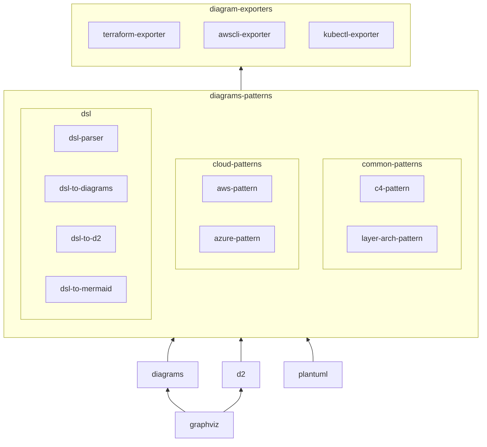

# diagrams-patterns

- diagrams should only used for managing the basic shapes of the cloud components
- but there are standard patterns usually used in cloud architecture, we don't need to draw them from scratch
- e.g. VPC with public/private subnets, NAT gateway, etc.

**diagrams-patterns** is a collection of patterns for diagrams that can be reused in different projects.

## Features

- [x] aws vpc, subnets with styles
  - 
- [x] aws overlapping az on subnets
  - calculate the position based on the number of az and subnets
  - store and reuse the calculated position
  - 
- [x] aws grid subnets with az
  - ~~use 'anchor', a hidden node, to align the subnets~~
  - not really work
  - 
- [ ] dsl investigate
  - dsl 2 py 2 diagrams (refer to d2)

## Roadmap

Currently, the **diagrams-patterns** and diagrams-exporters are built as 'diagrams'-extensions. But since the diagrams is inactive, introducing new tools is a necessary step, e.g. d2.

At that time, the **diagrams-patterns** should be a standalone tool, which provide a standard DSL to describe the common patterns in cloud architecture (or other kinds of diagrams). Then, you can translate the DSL to different tools, e.g. diagrams, d2, etc.

The **diagrams-exporters** plays another role to facilitate with productive tools, e.g. terraform, aws cli, etc. It read the metadata, convert to DSL, then generate the diagrams.

A possible structure is:

## Reference

- graphviz & dot
  - <https://github.com/pydot/pydot>

- d2
  - <https://github.com/terrastruct/d2>
  - <https://github.com/MrBlenny/py-d2>

- read tfstate and generate graph
  - <https://github.com/cycloidio/inframap>
  - <https://github.com/28mm/blast-radius>

- read aws cli and generate graph
  - <https://github.com/Cloud-Architects/cloudiscovery>

- other terraform interesting tools
  - <https://github.com/cycloidio/terracost>
  - <https://pypi.org/project/python-hcl2/>
